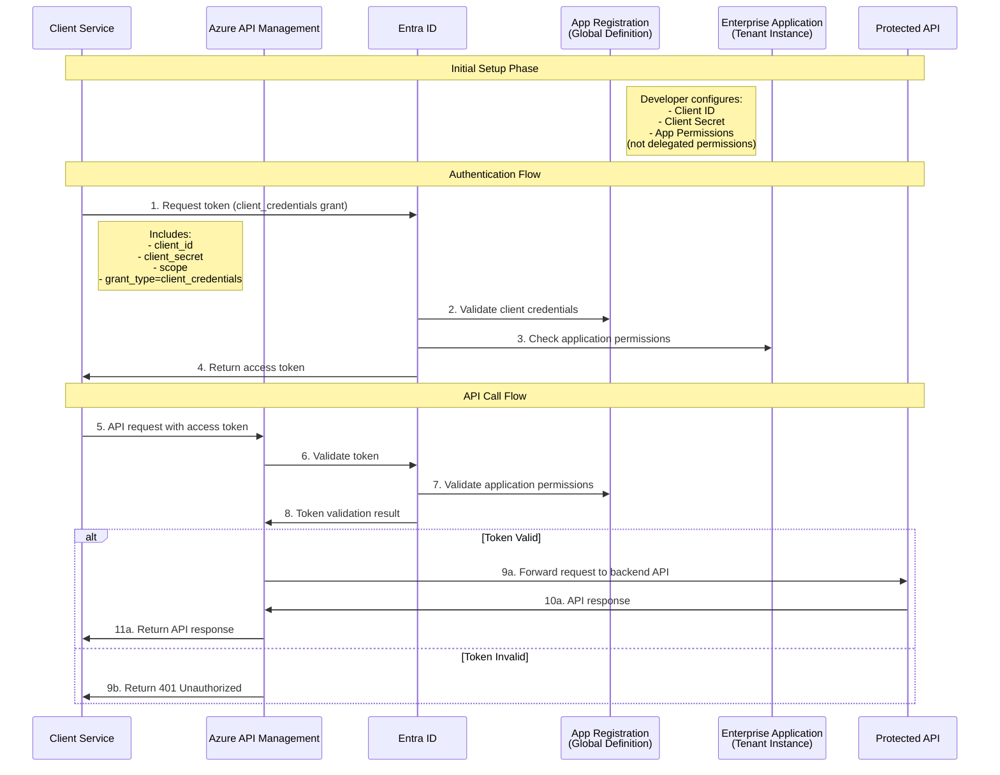

# AppRegistrationManagement

## Getting started

These scripts can be used when establishing a `Oauth2 Client Credentials Flow` with a resource API and one or many clients. 

An Oauth2 Client Credential Flow with EntraId and API Management looks something like this:



To run the scripts you will need the following permissions:  

| Permission Type                    | Permission Scope                        | Purpose                                         |
|------------------------------------|-----------------------------------------|-------------------------------------------------|
| **Microsoft Graph API Permission** | `Application.ReadWrite.OwnedBy`         | Create and manage owned app registrations       |
| **Microsoft Graph API Permission** | `User.Read.All`                         | Read user profiles for owner assignment         |
| **Azure Key Vault Role**           | `Key Vault Secrets User` (or equivalent)| Create/update secrets in Key Vault              |

You will also need the Microsoft Graph PowerShell SDK and the Azure PowerShell Module. These modules provide the necessary cmdlets to interact with Microsoft Graph API and Azure services.

```pwsh
Install-Module Microsoft.Graph -Scope CurrentUser
Install-Module Az -Scope CurrentUser
```
Ensure these modules are installed and authenticated with the appropriate permissions before running the script.

### Install Powershell Module for AppRegistrations
The below module exposes a number of powershell cmd-lets that is used to:
- Create App Registrations for Resource Applications (with scope and application roles)
- Create App Registrations for Client Applications (with secret and api permissions)
- Add roles (and grants) to an existing client application

To install the Powershell module do the following:
- Create a gitlab access token in your [gitlab settings](https://gitlab.com/-/user_settings/personal_access_tokens). Make sure till has atleat scopes: `api`, `read_api`

```pwsh
Register-PSResourceRepository -Name Intropy -Uri https://gitlab.com/api/v4/projects/64279070/packages/nuget/index.json -Force -Trusted

$cred = Get-Credential
# Enter your credentials.
# User: <your gitlab username>
# Password for user <your gitlab username>: <gilab access token>

Install-PSResource EntraAppRegistration -Scope CurrentUser -Credential $cred
Find-PSResource -Repository Intropy -Name EntraAppRegistration -Credential $cred
```
### Set correct tenant id
```pwsh
Connect-MgGraph -Scopes "Application.ReadWrite.All" -TenantId <tenantid>
```

### API Resource App configuration

#### Create a new app registration for your resource by issuing the following powershell command:

```pwsh
Set-EntraResourceAppRegistration -ApplicationName MyFineApiAcc -ExposeApi $true -AppRoles Default, Writer -Owners someone@integrio.se, someone.else@integrio.se -KeyVaultName igraccshared01kv
```
The script performs the following actions:

1. Connects to Microsoft Graph and Azure services.
2. Creates a new app registration or updates an existing one with specified app roles.
3. Exposes the API if requested, generating and storing the identifier URI in Azure Key Vault.
4. Assigns specified users as owners of the application.

When the script has executed you will have a new App Registration configured according to our best practices.

If you get an error similar to the one below when executing the script. Please make sure that you have set the correct tenant id as was explained in the previous step.
```txt
Set-EntraResourceAppRegistration: Failed to create/update resource app registration: Insufficient privileges to complete the operation.

Status: 403 (Forbidden)
ErrorCode: Authorization_RequestDenied
Date: ...
...
```

#### Token validation in APIM
This should be used when setting up a new API to validate jwt tokens. Here is a policy snippet you can use in the inbound policy segment:  

```xml
<validate-azure-ad-token tenant-id="{{TenantId}}">
    <audiences>
        <audience>api://{{ApplicationName}}</audience>
    </audiences>
    <required-claims>
        <claim name="roles" match="any">
            <value>Default</value>
        </claim>
    </required-claims>
</validate-azure-ad-token>
```

This will ensure that the client token has the correct audience and claims to access the API.

### Client App Configuration

#### External Client or client without a Managed Identity
If the client consuming the API does not have a Managed Identity, you need to create a new App Registration for the client by issuing the following powershell command:

```pwsh
Set-EntraClientAppRegistration -ClientApplicationName MyFineClientAcc -ResourceApplicationName MyFineApiAcc -AppRolesToAssign Default, Writer -Owners someone@integrio.se, someone.else@integrio.se -KeyVaultName igraccshared01kv 
```
The script performs the following tasks:

1. Connects to Microsoft Graph API.
2. Checks if the resource and client applications already exist. If the client application doesn’t exist, it creates a new app registration and service principal.
3. Assigns specified app roles from the resource application to the client application.
4. Optionally generates a long-term secret for the client application, stores it in Azure Key Vault if specified, and sets the client ID as a secret in the Key Vault. KeyVault Secret name will be: `{ClientApplicationName}-{SecretName}-client-secret/id`
5. Assigns specified users as owners of the client application.

Your external client will need:

- ClientId for the Client App Registration
- ClientSecret for the Client App Registration
- Scope for the Resource App Registration (`api://{ResourceApplicationName}`)
- ocp-apim-subscription-key for the API
- Token endpoint
- API endpoint

Enter this information in a new 1Password API Credential and share it with the client using 1Password share item functionality. Restrict the access to a email address or to a single view.

#### Client with Managed Identity

If the client counsuming the API does have a Managed Identity, we can assign App Roles to the existing identity. Thus removing the need for a new App Registration. Execute the powershell command 

```pwsh
Add-EntraManagedIdentityRoles -ManagedIdentityName igraccappname01func -ResourceApplicationName MyFineApiAcc -AppRoleNames Default, Writer
```

The script performs the following actions:

1. Connects to Microsoft Graph.
2. Verifies the existence of the specified managed identity and resource application.
3. For each app role in the list, it checks if the role exists in the resource application and assigns it to the managed identity.
4. Outputs a confirmation for each successful role assignment or a warning if a role is not found.

**NOTE**  
The token your application receives are cached by the underlying Azure infrastructure. This means that any changes to the managed identity's roles can take significant time to process (up to 24h).

Docs:  
https://learn.microsoft.com/en-us/entra/identity/managed-identities-azure-resources/how-to-assign-app-role-managed-identity?pivots=identity-mi-app-role-powershell  
https://learn.microsoft.com/en-us/entra/identity/managed-identities-azure-resources/managed-identity-best-practice-recommendations#limitation-of-using-managed-identities-for-authorization

#### Add Role Assignment to an app registration

If you would like to create an appregistration ans service principal and assign e.g. azure built-in roles issue the following powershell commands

```pwsh
Set-EntraClientAppRegistration -ClientApplicationName "mytestclientapp3" -Owners someone@integrio.se 

Add-RoleAssignment `
    -ApplicationName "mytestclientapp3" `
    -SubscriptionName "Integrio-Dev" `
    -TargetResourceGroupName "igdtestcontainerapp" `
    -TargetResourceName "irgtestcontainerregistry01acr" `
    -RoleDefinitionId $AzureBuiltInRoles.AcrPush
```
See exported variable `$AzureBuiltInRoles` for more supported roles